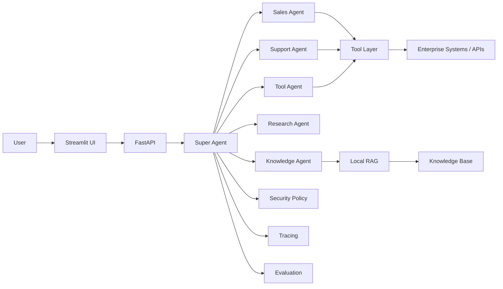

# Architecture

## Architectural boundaries

### Experience layer
Streamlit provides a simple human-facing interface.

### API layer
FastAPI provides a stable service boundary.

### Orchestration layer
The Super Agent routes requests to bounded specialists.

### Specialist layer
Each specialist owns a narrow responsibility.

### Tool layer
Tools abstract deterministic external capabilities.

### Knowledge layer
RAG provides grounded access to enterprise knowledge.

### Security layer
Prompt-injection checks, approvals, and least-privilege patterns reduce risk.

### Evaluation layer
Golden cases verify task success and tool selection.

## Production extensions

- Replace demo data with governed APIs.
- Add enterprise identity.
- Add persistent distributed tracing.
- Add model gateway and provider routing.
- Add policy engine.
- Add durable workflow execution.
- Add queueing for long-running tasks.
- Add full audit logging.
